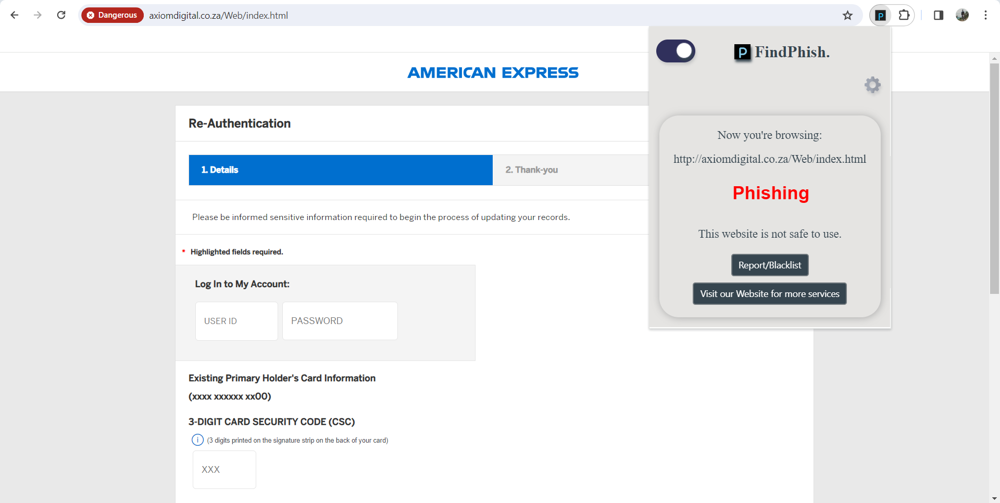
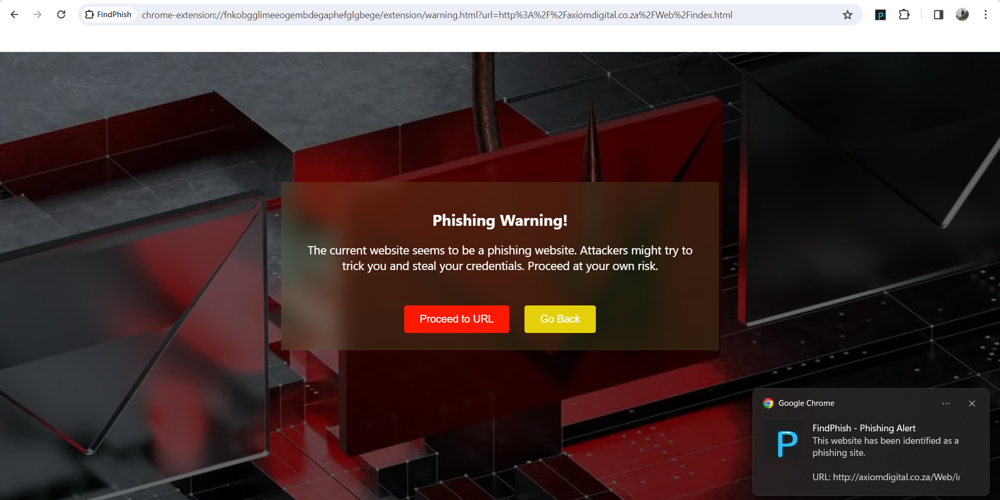
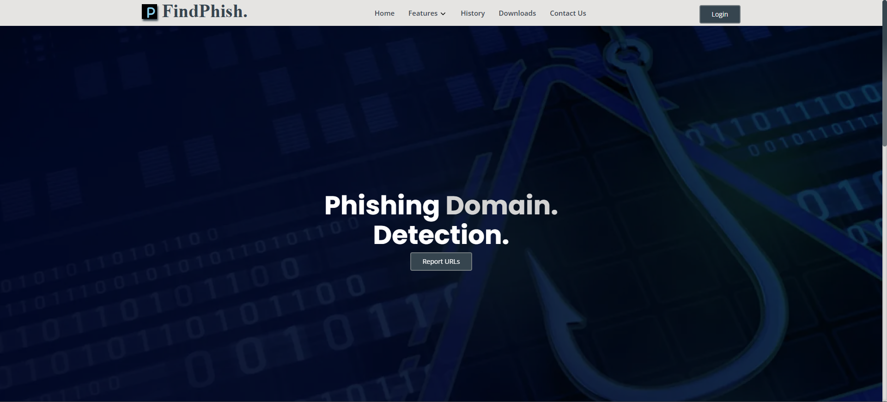

<h1 align="center">  FindPhish: Phishing Detection System </h1>

This phishing detection system using State-of-the-Art Artificial Intelligence and Machine Learning and this extension aims to detect phishing websites and warn the user. It is built with a objective of privacy, so that the extension is developed to protect users from potential phishing attacks. With the Anti-Phishing Extension, users can easily check the safety of the websites they visit.


[](https://www.python.org/)
[](https://github.com/NikhilAMathew/Phishing)
[](https://github.com/NikhilAMathew/Phishing)

## Table of Contents

1. [Features](#features)
2. [Extension Overview](#extension-overview)
3. [Webpage Overview](#webpage-overview)
4. [Directory Structure](#directory-structure)
5. [Installation](#installation)
   - [Manually](#manually)
6. [Usage](#usage)
7. [Contact](#contact)

## Features

- **Real-Time Website Scanning**: The Extension scans the websites visited by the user in real-time.
- **Real-Time User Notifications**: The Extension alerts the users through the email and chrome notifications when the visited website is phishing in real-time.
- **User Customizable Settings**: The user can activate/deactivate the toggle buttons for various features.
and so more features**

## Extension Overview


The Anti-Phishing Extension is designed to serve as a primary defense line against malicious phishing websites for users. Incorporating a mix of real-time website scanning and an updated blacklist check, the extension strives to provide a seamless and secure browsing experience.

### How it Works

1. **Real-Time Scanning:** 
   - Once a webpage is accessed, the extension immediately begins its scanning process in the background.
   - It evaluates the structure of the website, domain details, and other metadata to determine its authenticity.

2. **User Notification and Blockage:**
   - Should the website be flagged as suspicious, an overlay alert system is activated. This overlay will cover the entire website, preventing the user from interacting with potentially harmful content.
   - This ensures that users do not accidentally engage in potentially harmful activities, such as interacting with fake crypto wallets or entering sensitive information like credit card details.
   
   
   
3. **Active/Inactive Toggle:**
   - The extension comes with a toggle button allowing users to activate or deactivate its functionality as per their needs.
   - By toggling the extension to the inactive state, it will cease its scanning and alert processes until reactivated.


## Webpage Overview


The Phishing Detection Website is designed to provide user to know about the URL/IP with all details and users can report the phishing, malcious or suspicious URL/IP.


### How it Works

1. **Checking URL/IP:** 
   - Users can get all the detail about URL/IP by simply inputing the URL/IP addresses.
   - The details can be helpfull to prevent the users from interacting with potentially harmful content.

2. **Reporting Domains:**
   - Users can report or blacklist the various domains like URL/IP which phishing, malicious or suspicious.
   
3. **User Queries:**
   - The users can directly contact with the experts who are related to cyber security.


## Directory Structure

- `frontend/`: This directory contains the source code for the Chrome extension.
- `phish_api/`: This directory holds the source code for the phishing detectiong website.


## Installation

### Manually

1. Clone the repository to your local machine.
   ```sh
   git clone https://github.com/NikhilAMathew/Phishing.git
   ```
2. Open `chrome://extensions/` page in your Chrome browser.
3. Enable "Developer mode" in the top right corner.
4. Click on "Load unpacked" and select the `frontend/` directory from the cloned repository.
5. The Extension should now be installed and active in your browser.

## Usage

Once the Extension is successfully installed, it will be active in your browser. The websites you visit will be automatically scanned, and you will receive alerts if a website is on the blacklist.

## Contact

If you have any questions about our project, you can reach us at: [mathewnikhil432@gmail.com](mailto:mathewnikhil432@gmail.com)
